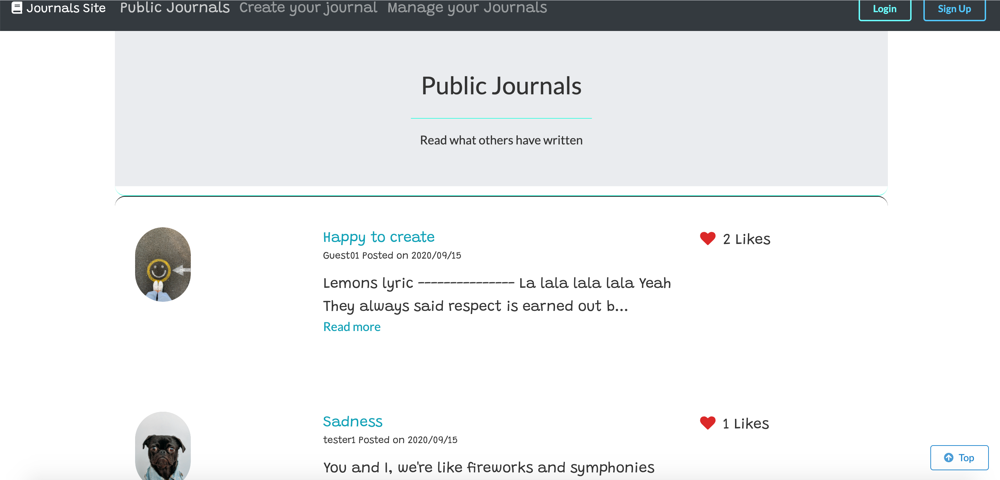
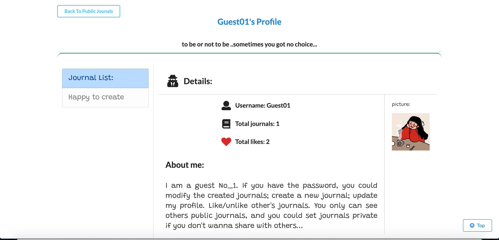
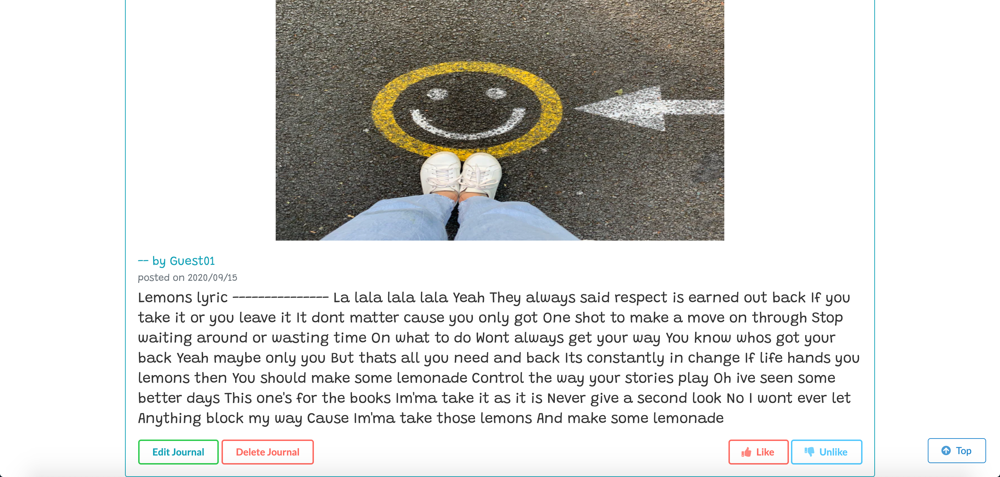

# journalSite

Journal Garden is a Blog-style MERN-Stack web application for users to keep life moments and ideas.
# Live Demo: 
- [JournalGarden Heroku Version](https://journal-garden.herokuapp.com/)
- You can log in with the following info:
  - Username: Guest01
  - Passowrd: guest123
## Demo images

# Features

- Authentication:
  - User login with username and password
- Authorization:
  - One cannot manage journals and user profile without being authenticated
  - One cannot edit or remove journals created by other users
- Manage journals with basic functionalities:
  - Create, edit and delete journals, like/unlike journals
  - Set journal to be private/public
  - Private journals are invisible to other user
  - Upload journal image
- Flash messages responding to users’ interaction with the app
- Responsive web design

# Custom Enhancements

- Used Google Fonts and Font Awesome instead default fonts
- Used momentJS to show journals creation and update timestamp
- Added one-key to set all journals to be private, which will be invisible to other users
- Upload journal image locally and stored on Cloudinary

# Built with

- Front-end
  - [React](https://github.com/facebook/react)
  - [Redux](https://github.com/reduxjs/redux)
  - [Font Awesome](https://fontawesome.com/)
  - [Google Font](https://fonts.google.com/)
  - [Semantic-ui-React](https://react.semantic-ui.com/usage)
  - [React-Bootstrap](https://react-bootstrap.github.io/)
  - [moment](https://momentjs.com/)
  - [React-Router-Dom](https://github.com/ReactTraining/react-router/tree/master/packages/react-router-dom)
  - [axios](https://github.com/axios/axios)
  - [validator](https://github.com/validatorjs/validator.js)
- Back-end
  - [Express](https://expressjs.com/)
  - [MongoDB](https://www.mongodb.com/)
  - [JWT](https://github.com/auth0/node-jsonwebtoken)
  - [Mongoose](https://mongoosejs.com/)
  - [dotenv](https://www.npmjs.com/package/dotenv)
  - [bcryptjs](https://www.npmjs.com/package/bcryptjs)
  - [gravatar](https://en.gravatar.com/)
  - [normalize-url](https://www.npmjs.com/package/normalize-url)
# Platforms

- [Cloudinary](https://www.npmjs.com/package/cloudinary)
- [Heroku](https://heroku.com/)
